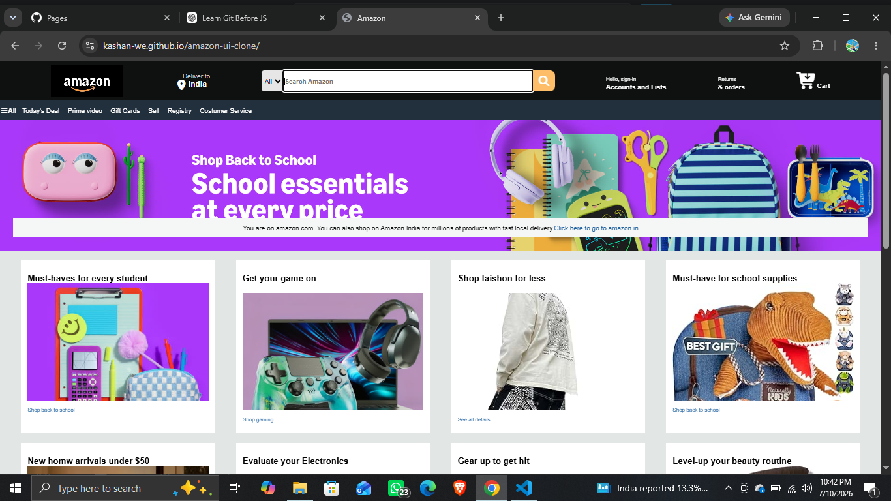

# Amazon UI Clone 🛒

A frontend clone of the Amazon homepage built using **HTML5 and CSS3**. This project recreates the visual design and layout of Amazon's website, including the navigation bar, search section, hero banner, product cards, and footer.

This project was created as a part of my frontend development learning journey to practice webpage structure, styling, layouts, and UI design.

## 🚀 Live Demo

🔗 **Website:** https://kashan-we.github.io/amazon-ui-clone/

## 📌 Features

* Amazon-inspired navigation bar
* Location and delivery section
* Search bar with category selector
* Hero banner section
* Product category cards
* Amazon-style footer
* Hover effects and interactive UI elements
* Responsive layout structure

## 🛠️ Technologies Used

* **HTML5** – Structure and content
* **CSS3** – Styling, layouts, and animations
* **Font Awesome** – Icons

## 📂 Project Structure

```
amazon-ui-clone/
│
├── index.html
├── style.css
├── hero_image.jpg
├── box-1.jpg
├── box-2.jpg
├── box-3.jpg
├── box-4.jpg
├── box-5.jpg
├── box-6.jpg
├── box-7.jpg
├── box-8.jpg
└── README.md
```

## 📸 Screenshots


```

```

## 🎯 Purpose of This Project

The goal of this project was to improve my understanding of:

* HTML page structure
* CSS Flexbox layouts
* Styling complex web pages
* Creating reusable UI components
* Working with images and external libraries
* Deploying websites using GitHub Pages

## 🌱 Future Improvements

I plan to add:

* JavaScript-based search functionality
* Product filtering
* Add to cart functionality
* Responsive mobile navigation
* User interaction features

## 👨‍💻 Author

**Kashan**

* GitHub: https://github.com/Kashan-we

## ⚠️ Disclaimer

This project is a **learning and educational project** created for practicing frontend development. It is not affiliated with or an official website of Amazon.
